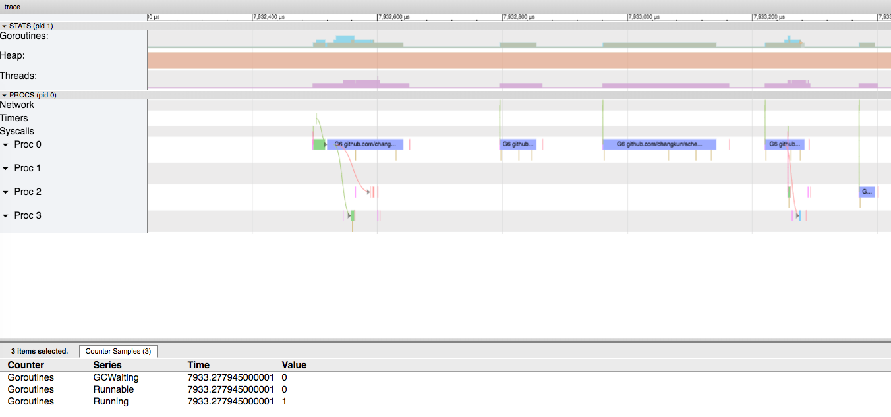
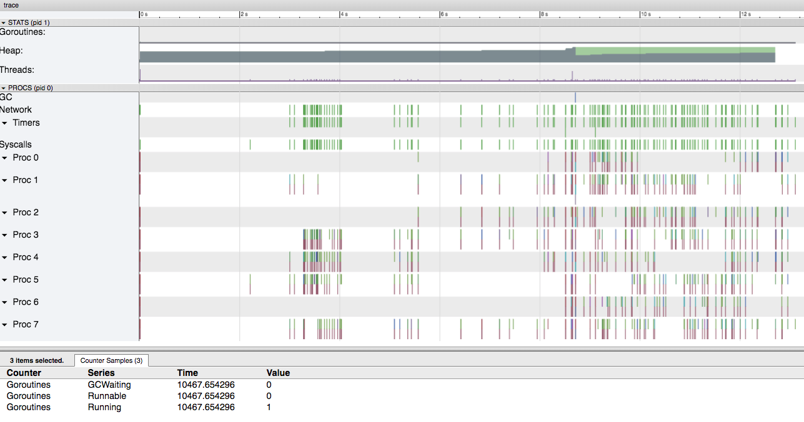
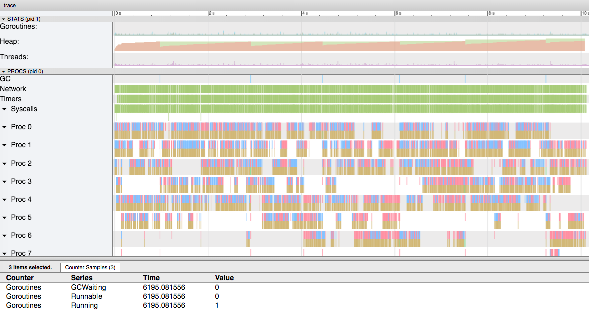

# `sched` 性能测试

[](./bench.md) [](./bench_cn.md) 

`sched` 测试了 [./main.go](./main.go) 中所示代码的调度性能。具体的调度场景是：

1. 每个调度的任务会执行 `retry` 次
2. 一共调度 `total` 个执行时间随机分布的任务
3. 总调度时长不超过 10 秒

## 结论

1. 任务调度的精度取决于 Go `time.Timer` 以及与 Redis 的 IO 性能
2. 在密集型调度的场景中会出现一定程度延迟，但调度仍然是可靠的
3. `sched` 在调度过程中尽可能低的减少了并发执行的 goroutine 数

## 2 项任务

```
Execute retry task task-1, retry count: 0. tollerance: 2.827ms
Execute retry task task-1, retry count: 1. tollerance: 3.749ms
Execute retry task task-1, retry count: 2. tollerance: 4.647ms
Execute retry task task-1, retry count: 3, tollerance: 738µs, last retry.
Execute retry task task-0, retry count: 0. tollerance: 1.858ms
Execute retry task task-0, retry count: 1. tollerance: 429µs
Execute retry task task-0, retry count: 2. tollerance: 1.514ms
Execute retry task task-0, retry count: 3, tollerance: 1.531ms, last retry.
```

最终统计结果如下：

```
                   6 Execution in 194ms
--------------------------------------------------------------
        required execution:  6
          actual execution:  6
--------------------------------------------------------------
   first required schedule:  Sep 26 06:53:23.720003000
     first actual schedule:  Sep 26 06:53:23.722830000
--------------------------------------------------------------
    last required schedule:  Sep 26 06:53:23.914003000
      last actual schedule:  Sep 26 06:53:24.041534000
--------------------------------------------------------------
      first schedule delay:  2.827ms
       last schedule delay:  127.531ms
--------------------------------------------------------------
required execution density:  32.333333ms
  actual execution density:  53.117333ms
--------------------------------------------------------------
```



## 100 项任务

```
Execute retry task task-85, retry count: 0. tollerance: 6.929ms
Execute retry task task-85, retry count: 1. tollerance: 862µs
Execute retry task task-85, retry count: 2. tollerance: 4.172ms
Execute retry task task-63, retry count: 0. tollerance: 1.097ms
Execute retry task task-85, retry count: 3, tollerance: 4.472ms, last retry.
(...)
Execute retry task task-65, retry count: 3, tollerance: 1.693ms, last retry.
Execute retry task task-97, retry count: 3, tollerance: 442µs, last retry.
Execute retry task task-25, retry count: 1. tollerance: 1.179ms
Execute retry task task-25, retry count: 2. tollerance: 770µs
Execute retry task task-25, retry count: 3, tollerance: 5.764ms, last retry.
```

最终统计结果如下：

```
                   300 Execution in 9.888s
--------------------------------------------------------------
        required execution:  300
          actual execution:  300
--------------------------------------------------------------
   first required schedule:  Sep 26 06:57:29.156509000
     first actual schedule:  Sep 26 06:57:29.163438000
--------------------------------------------------------------
    last required schedule:  Sep 26 06:57:39.044509000
      last actual schedule:  Sep 26 06:57:39.176272000
--------------------------------------------------------------
      first schedule delay:  6.929ms
       last schedule delay:  131.763ms
--------------------------------------------------------------
required execution density:  32.96ms
  actual execution density:  33.376113ms
--------------------------------------------------------------
```



## 1000 项任务

```
Execute retry task task-447, retry count: 0. tollerance: 6.318ms
Execute retry task task-464, retry count: 0. tollerance: 27.498ms
Execute retry task task-401, retry count: 0. tollerance: 237µs
Execute retry task task-464, retry count: 1. tollerance: 237µs
Execute retry task task-85, retry count: 0. tollerance: 255µs
Execute retry task task-235, retry count: 0. tollerance: 232µs
Execute retry task task-785, retry count: 0. tollerance: 334µs
Execute retry task task-447, retry count: 1. tollerance: 342µs
(...)
Execute retry task task-774, retry count: 2. tollerance: 546µs
Execute retry task task-556, retry count: 3, tollerance: 635µs, last retry.
Execute retry task task-482, retry count: 3, tollerance: 742µs, last retry.
Execute retry task task-807, retry count: 3, tollerance: 732µs, last retry.
Execute retry task task-542, retry count: 3, tollerance: 723µs, last retry.
Execute retry task task-774, retry count: 3, tollerance: 1.238ms, last retry.
```

最终统计结果如下：

```
                   3000 Execution in 9.985s
--------------------------------------------------------------
        required execution:  3000
          actual execution:  3000
--------------------------------------------------------------
   first required schedule:  Sep 26 07:24:17.455580000
     first actual schedule:  Sep 26 07:24:17.481898000
--------------------------------------------------------------
    last required schedule:  Sep 26 07:24:27.440580000
      last actual schedule:  Sep 26 07:24:27.567817000
--------------------------------------------------------------
      first schedule delay:  26.318ms
       last schedule delay:  127.237ms
--------------------------------------------------------------
required execution density:  3.328333ms
  actual execution density:  3.361973ms
--------------------------------------------------------------
```

